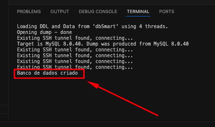
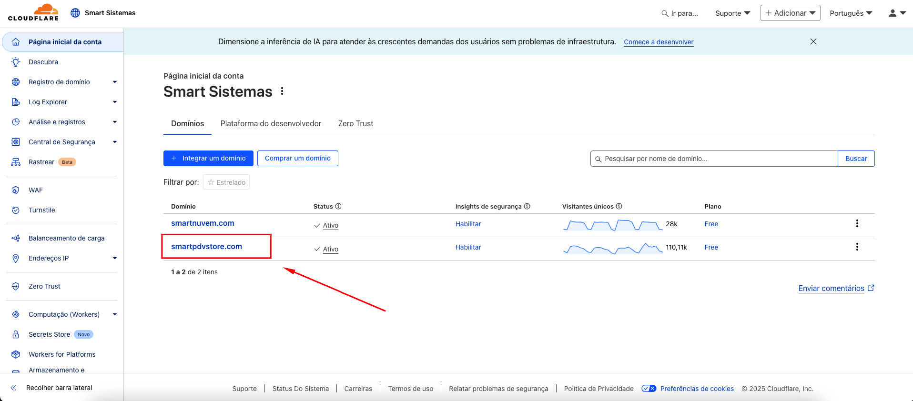
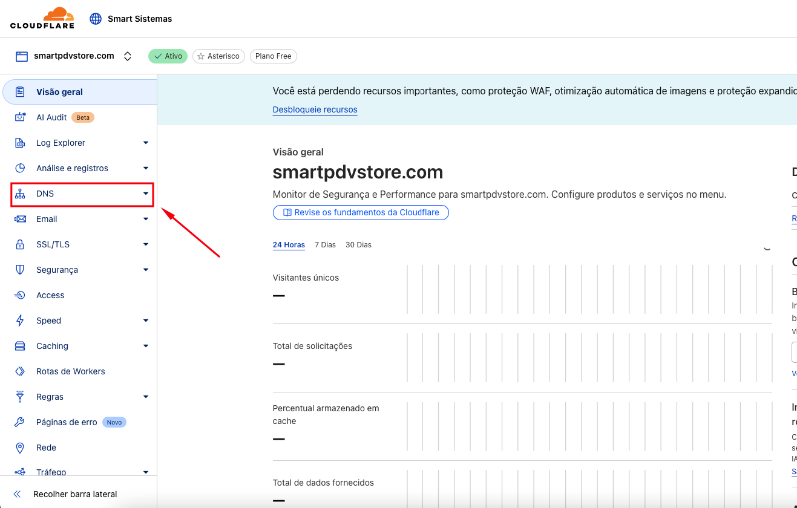
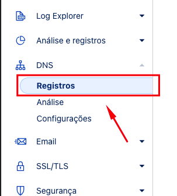
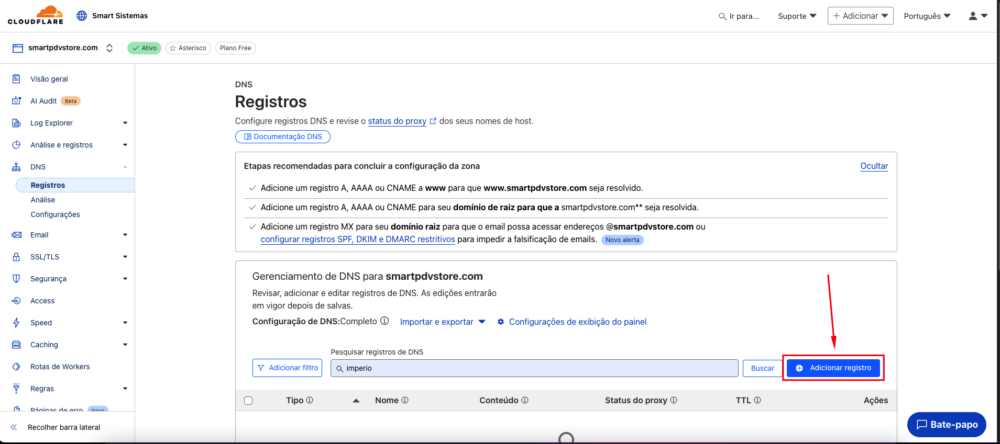
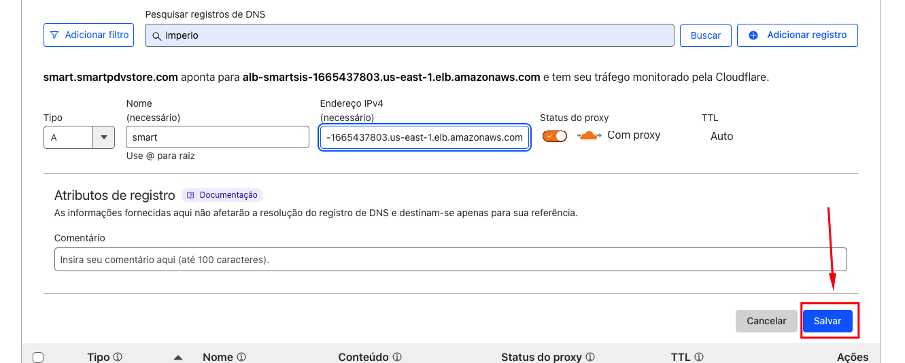

# Iniciar o Store-Maker

## 1 - Executar o comando no terminal: 
```bash
npm run start
```

## 2 - Responder o questionário 
- `Qual é o nome do cliente?` ex: nome **->** **smart**
- `Qual o domínio que o cliente irá utilizar?` ex: (**NomeAqui**.smartpdvstore.com)
- `Qual o número do contrato?` ex: contrato **->** `1234/5678`, inserir **->** `12345678`.
- `Qual o Apple Client Id do cliente?` Seguir os passos aqui **->** [Abra o arquivo (apple-client-id.md)](apple-client-id.md)
### Esperar finalizar a criação do `Store`
> Vai aparecer assim `Banco de dados criado`  


## 3 - Registrar [Cloudflare](https://www.cloudflare.com/pt-br/)

### Ir para `Cloudflare` e clicar sobre `smartpdvstore.com`


### Na barra lateral equerda clicar sobre o item `DNS` como mostra na imagem


### No menu `DNS`entra no `Registros`


### Copiar o o link de DNS 
```txt
alb-smartsis-1665437803.us-east-1.elb.amazonaws.com
```
### Clicar em `Adicionar Registros`


### Após clicado em **Adicionar Registros**
- Selecionar o **tipo**: `CNAME`.
- No **campo 1** setar o `Nome` ex **->** `smart`.
- No **campo 2** setar o `Destino` **->** `alb-smartsis-1665437803.us-east-1.elb.amazonaws.com`


### Depois clicar em `Salvar` e aguardar uns **5 min** para o DNS se propagar
 # web-store-pdv-readme
# web-store-pdv-readme
