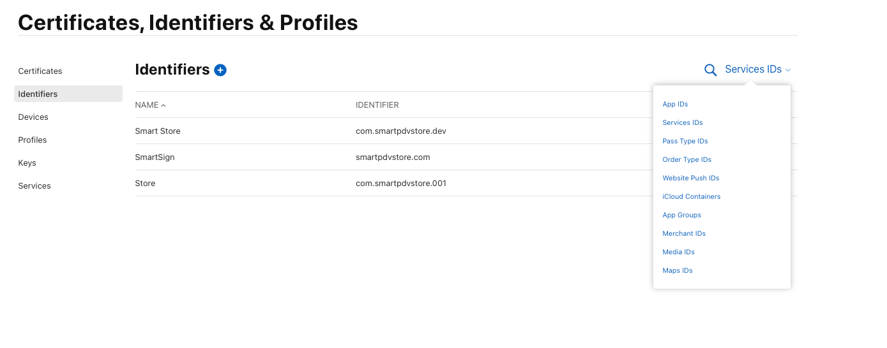
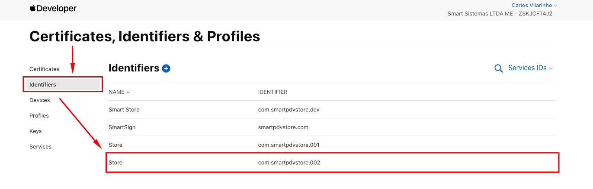
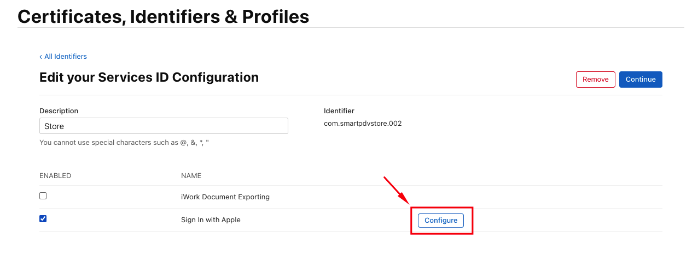
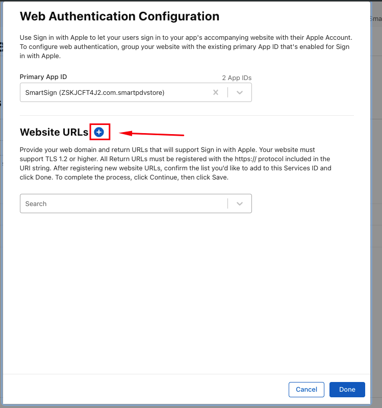
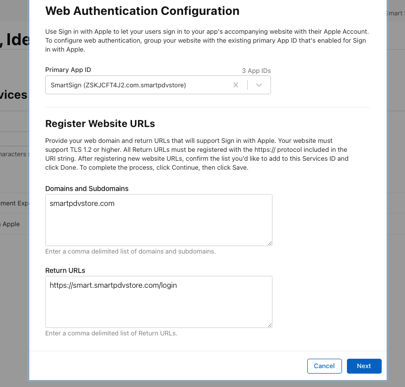
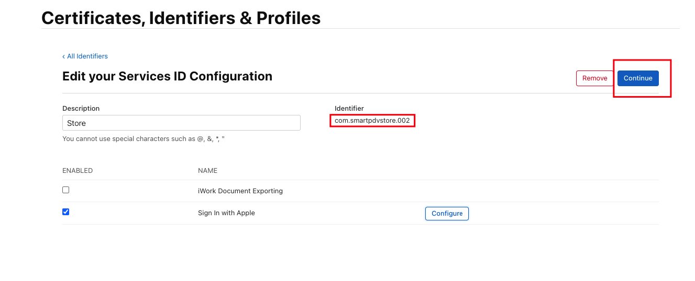

# Criar Apple Client ID

### Para acessar os Client IDs, acesse o [Painel da Apple](https://developer.apple.com/account/resources/identifiers/list/serviceId), vá até a seção `Identifiers` e selecione o filtro `Service IDs`.



### Você pode credenciar um novo serviço ou utilizar um já existente.
### **OBS:** O limite de URLs de callback e domínios é de 100.

###  Caso precise criar um novo, selecione `Service ID` e informe um `Identifier` único.
###  **Padrão recomendado para o Identifier:** `com.smartpdvstore.{numeração}`
### Ex: 
```
- com.smartpdvstore.001
- com.smartpdvstore.002
- com.smartpdvstore.003 ...
```
### Após isso, o ambiente já estará configurado na Apple.

###  O **Client ID** que deverá ser cadastrado no sistema (store) é o mesmo `Identifier` do Service ID que foi criado ou editado.

# Criar ID do Cliente

### Para acessar os Client IDs, acesse o [Painel da Apple](https://developer.apple.com/account/resources/identifiers/list/serviceId), vá até a seção `Identifiers` e clica sobre o nome do `IDENTIFIER`


### Clique sobre o `Configure`


### Clique sobre o ícone `+`


### Colocar o `Domains and Subdomains`e também `Return URLs`
- Domains and Subdomains **->** `smartpdvstore.com`
- Return URLs **->** `https://NomeAqui.smartpdvstore.com/login`
### Clicar em `Next`

### Copiar o código `Apple Client Id` e dar `Continue` 

### e depois `Salvar`.
